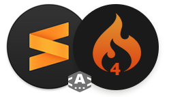

  


SublimeSnippets for CodeIgniter4
================================


-- A work in progress! --
-------
That project was started for my own needs, but some real documentation will follow and the rest of the usefull tags.


Install
-------

---

### Sublime Text - Package Control or Clone/Download

When i'll add more snippets, the repo will be proposed as a Sublime Package, but until then you can clone or download it and place the folder inside '**SublimeText3\Packages\User**' folder.


ci- here we go...
--------

**Code** | **Renders** | **Tip**
---|---|---
 `[ci-m]+Tab` | Model | *Have inside the basics for db connection*
 `[ci-c]+Tab` | Controller | *With data loading from the model and view rendering*
 `[ci-l]+Tab` | Layout | *Naked skeleton, to work with the view below*
 `[ci-v]+Tab` | Vue | *Extending the layout above ^^*
 --- | **- inside Controllers -** | ---
 `[ci-hw]+Tab` | HelloWorld Controller | *The most basic controller, as a starting point.*
 `[ci-pubF]+Tab` | public function | *For the methods within Controllers, and more*
 `[ci-ptcF]+Tab` | protected function | *For the private logic. See Controllers doc.*
 `[ci-tReq]+Tab` | $this->request | *...*
 `[ci-tRsp]+Tab` | $this->response | *...*
 `[ci-tLog]+Tab` | $this->logger | *...*
 `[ci-load-helpers]+Tab` | Load needed helpers | *Better to load them once in a BaseController*
 `[ci-new-Model]+Tab` | Create the instance... | *Can be done if we first `ci-use-Model`*
 `[ci-get-Model]+Tab` | ...grab the Data. | *Create the array with the data for the 'loop'*
 `[ci-isFile-thEx]+Tab` | Check if file exist | *If not, throw exception. Done before load views.*
 `[ci-data]+Tab` | Creates the $data array | *The strings and arrays to be sent into the Views*
 `[ci-load-Parser]+Tab` | Makes the Parser available | *Captain Obvious striked again.*
 `[ci-load-PView]+Tab` | Renders a 'parsed' View | *Where we echo variables as {title}*
 `[ci-echo-View]+Tab` | Renders a PHP View | *Where we echo variables as <?= $title ?>*
 --- | **- Routing -** | ---
 `[ci-routesGrp]+Tab` | route Group | *Nesting routes that share the same initial segment.*
 `[ci-routes]+Tab` | simple route | *Like the 'about' route, loading the 'About' Controller*
 `[ci-routesSeg]+Tab` | (:segment) route | *Great for single posts. Match first segment.*
 `[ci-RoutesAny]+Tab` | (:any) route | *Will match everything from the URI*
 `[ci-RoutesNum]+Tab` | (:num) route | *When expecting a numeric segment like xByID/$id*
 `[ci-RoutesAlpha]+Tab` | (:alpha) route | *No numbers*
 `[ci-RoutesAlNum]+Tab` | (:alphanum) route | *Letters and/or numbers*
 `[ci-RoutesHash]+Tab` | (:hash) route | *See the Models Docs for the usage*
 --- | **- Build Responses -** | ---
 `[ci-list-errors]+Tab` | Show validation errors | *Often placed right above the Form*
 `[ci-loop]+Tab` | Looping trough arrays | *That's the PHP version with `foreach` and `/foreach`*
 `[ci-e]+Tab` | <?= $foo ?> | *Echo out a variable sent by the controller within the $data array*
 `[ci-et]+Tab` | <?=  ?> | *Just the empty 'EchoTag' in its short version*
 `[ci-var]+Tab` | $foo['bar'] | *Use that inside `ci-loop` to print the variables from the result*
 --- | **- Some Basics -** | ---
 `[ci-t]+Tab` | $this-> | *...preaty self explanatory.*


### ``[ci-m]+Tab`` Model File

Usual models location: *App/Models/*


The meaning of the config settings are in the docs at [CI4 Docs> Modeling Data> Using CodeIgniter's Model](https://codeigniter4.github.io/userguide/models/model.html).

The exemple function is from the official ["News section" tutorial](https://codeigniter4.github.io/userguide/tutorial/news_section.html).

#### Tab steps:
- ${1:App}  : *In case you changed your app namespace.*
- ${2:News} : The name of your Model file (always uppercase first letter).
- ${3:news} : The corresponding database table (lowercase).
- ${4:id}   : *In case you changed the primary_key*
- ${0}      : The mouse cursor will end here after last tab.

```php
<?php namespace ${1:App}\Models;

use CodeIgniter\Model;

class ${2:News}Model extends Model
{
    protected \$table = '${3:news}';  
    protected \$primaryKey = '${4:id}';

    protected $returnType = 'array';
    protected $useSoftDeletes = false;

    protected \$allowedFields = ['title', 'slug'];

	// protected $useTimestamps = false;
	// protected $createdField  = 'created_at';
	// protected $updatedField  = 'updated_at';
	// protected $deletedField  = 'deleted_at';

	// protected $validationRules    = [];
	// protected $validationMessages = [];
	// protected $skipValidation     = false;

    // Exemple function to retrive data
    public function get${2:News}(\$slug = false)
    {
        if (\$slug === false)
        {
            return \$this->orderBy('id', 'desc')->findAll();  // Get all records
        }
        return \$this->asArray()
                     ->where(['slug' => \$slug])
                     ->first();
        ${0}                                            // or Get one record
    }

}
```
To follow along with the official tutorial, create the news table as follow:

Within phpMyAdmin
```SQL
CREATE TABLE news (
        id int(11) NOT NULL AUTO_INCREMENT,
        title varchar(128) NOT NULL,
        slug varchar(128) NOT NULL,
        body text NOT NULL,
        PRIMARY KEY (id),
        KEY slug (slug)
);

INSERT INTO news VALUES
(1,'Elvis sighted','elvis-sighted','Elvis was sighted at the Podunk internet cafe. It looked like he was writing a CodeIgniter app.'),
(2,'Say it isn\'t so!','say-it-isnt-so','Scientists conclude that some programmers have a sense of humor.'),
(3,'Caffeination, Yes!','caffeination-yes','World\'s largest coffee shop open onsite nested coffee shop for staff only.');
```

In the .env file from CI root folder:
```
database.default.hostname = localhost
database.default.database = ci4tutorial
database.default.username = root
database.default.password = root
database.default.DBDriver = MySQLi
```

... that will create a basic news table.

---

### ``[ci-c]+Tab`` Controller File

Usual controllers location: *App/Controllers/*


Keeped (commented) the basic stuff needed to get data from a Model,
the exemple works with the News model from the official tutorial.

Read the [Controllers Doc](https://codeigniter4.github.io/userguide/incoming/controllers.html) for more details.

#### Tab steps:
- ${1:App}  : *In case you changed your app namespace.*
- ${2:News} : The name of your Controller file (always uppercase first letter).
- ${3:news} : The corresponding database table (lowercase).
- ${4:id}   : *In case you changed the primary_key*
- ${0}      : The mouse cursor will end here after last tab.

```php
<?php namespace ${1:App}\Controllers;

use CodeIgniter\Controller;
//use App\Models\NewsModel;

class ${2:News} extends Controller
{
    public function index()
    {
        //\$model = new NewsModel();

            \$data = [
                //'news'  => $model->getNews(),
                'title' => 'Some title',
            ];

         echo view('${3:news}/${4:index}', $data);        
    }      
}
```


### ``[ci-l]+Tab`` Layouts

Usual layouts location: *App/Views/Layouts/*

Basically an HTML skeleton with at least one 'section' inside,
acting like a placeholder into the views extended from the layout.

```php
<!DOCTYPE html>
<html lang="en">
<head>
	<meta charset="UTF-8"/>
	<title>Layout</title>
</head>
<body>
	<?= $this->renderSection('content') ?>
</body>
</html>
```

### ```[ci-v]+Tab``` View

Snippet file: *CI4-Snippets/ci4-view.sublime-snippet*

Usual models location: *App/Views/*

Filling up the sections defined into the layout.

```php
<?= \$this->extend('${1:layouts/main}') ?>


<?= \$this->section('${2:content}') ?>    

${3:content goes here}

<?= \$this->endSection() ?>
```


License
-------

Copyright 2019, Andrei Curelaru <andrei@andikod.fr>

MIT
